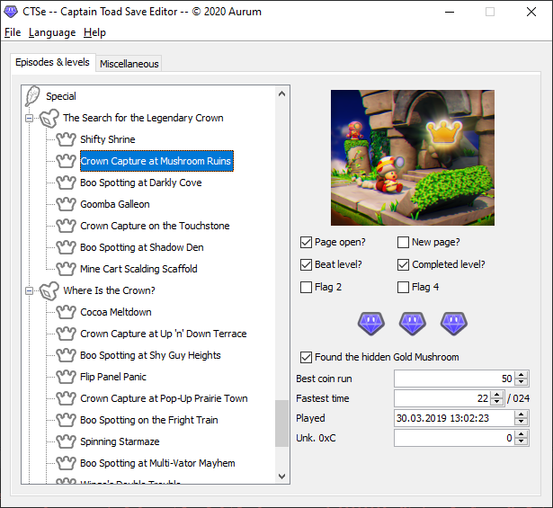

# CTSe - Captain Toad Save Editor
A save game editor for Captain Toad Treasure Tracker (Switch) files. This project uses the [org.json library](https://mvnrepository.com/artifact/org.json/json).

## Current features
- Edit level data and scores
- Unlock levels
- Edit 1-UPs count

## Planned features
- Convert Wii U saves to Switch saves
- Convert 3DS saves to Switch saves
- Update Switch saves to version 2 (DLC & VR)
- Game flag editing
- Book editing
- More languages!

## How to contribute
As described in **Planned features** we need to document game flags properly and the book structure format in order to improve this editor. Just file an issue if you want to help me out!